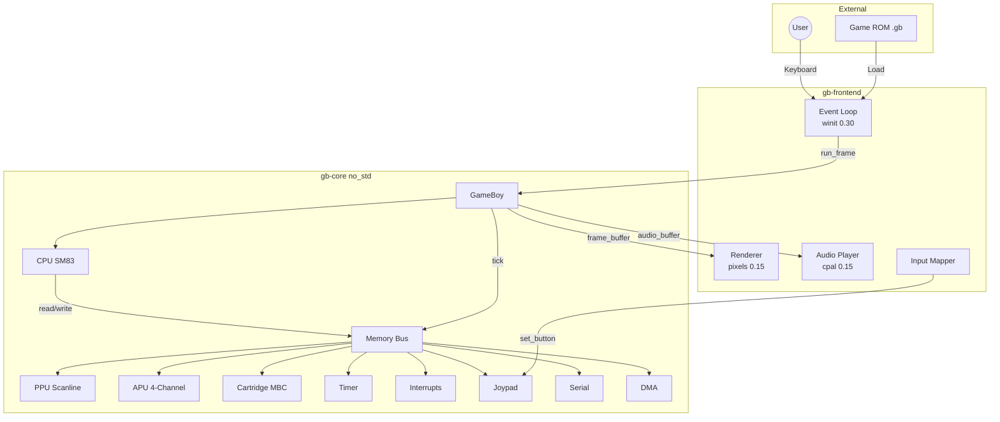
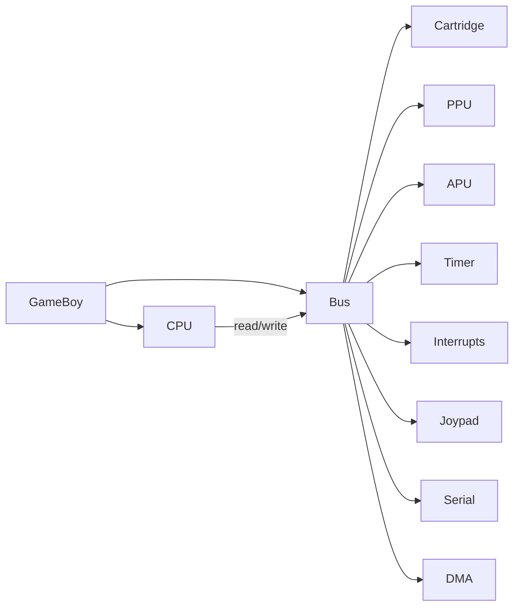
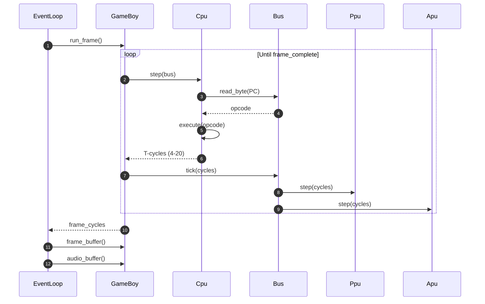
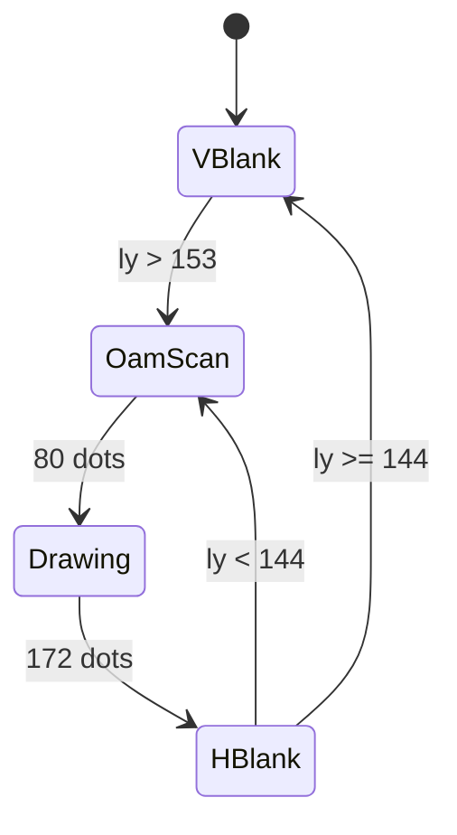

# Architecture: gb-emulator

A scanline-accurate Game Boy (DMG-01) emulator in Rust. Passes all 11 Blargg `cpu_instrs` tests and runs Pokemon Yellow correctly.

## Architecture Overview

### Classification

| Aspect | Finding |
| --- | --- |
| **Pattern** | Layered Monolith (core library + frontend binary) |
| **Scale Category** | Small (<10K LOC, ~30 source files) |
| **Maturity Level** | Production (passes reference test suite, runs commercial ROMs) |

### Project Type

Cargo workspace with two members:

- **gb-core**: `no_std`-compatible library crate (emulation engine, zero external dependencies)
- **gb-frontend**: Binary crate (desktop application with windowing, rendering, and audio)

Evidence: `Cargo.toml:1-3` (workspace definition with `resolver = "2"`)

## Technology Stack

### Languages and Runtimes

| Component | Language | Version | Evidence |
| --- | --- | --- | --- |
| Core engine | Rust | 1.93.1 | `gb-core/Cargo.toml` (edition = "2021") |
| Frontend | Rust | 1.93.1 | `gb-frontend/Cargo.toml` (edition = "2021") |

### Dependencies

| Crate | Version | Purpose | Used By |
| --- | --- | --- | --- |
| `pixels` | 0.15 | GPU rendering surface (wgpu backend) | gb-frontend |
| `winit` | 0.30 | Cross-platform windowing and event loop | gb-frontend |
| `cpal` | 0.15 | Cross-platform audio I/O | gb-frontend |
| `env_logger` | 0.11 | Logging output | gb-frontend |
| `log` | 0.4 | Logging facade | gb-frontend |

Evidence: `gb-frontend/Cargo.toml`

**gb-core has zero external dependencies** (uses only `core` and `alloc`).

### Infrastructure

| Aspect | Status | Evidence |
| --- | --- | --- |
| Container | None | No Dockerfile found |
| CI/CD | None | No `.github/workflows/` found |
| IaC | None | No terraform/k8s configs |
| License | MIT | `LICENSE` |

## High-Level Architecture

The system follows a two-layer architecture: a platform-agnostic emulation core and a desktop frontend.

**Diagram**: [diagrams/container.mmd](diagrams/container.mmd)

## Component Architecture

### gb-core (Emulation Engine)

The core library exposes a single `GameBoy` struct as its public API. Internally, it decomposes into subsystems connected through the memory bus.

**Diagram**: [diagrams/component/gb-core.mmd](diagrams/component/gb-core.mmd)

#### Module Inventory

| Module | Files | Purpose | Key Types |
| --- | --- | --- | --- |
| `cpu/` | mod.rs, registers.rs, opcodes.rs, cb_opcodes.rs | SM83 processor emulation | `Cpu`, `Registers` |
| `ppu/` | mod.rs, oam.rs | Scanline video renderer | `Ppu`, `OamEntry` |
| `apu/` | mod.rs, square.rs, wave.rs, noise.rs, frame_seq.rs | 4-channel audio synthesis | `Apu`, `SquareChannel`, `WaveChannel`, `NoiseChannel` |
| `cartridge/` | mod.rs, no_mbc.rs, mbc1.rs, mbc2.rs, mbc3.rs, mbc5.rs | ROM/RAM banking | `Cartridge` enum |
| `bus.rs` | bus.rs | Memory-mapped I/O decoder | `Bus` |
| `timer.rs` | timer.rs | DIV/TIMA timer with falling-edge detection | `Timer` |
| `interrupts.rs` | interrupts.rs | IE/IF/IME management | `InterruptController`, `Interrupt` |
| `joypad.rs` | joypad.rs | Button state management | `Joypad`, `Button` |
| `serial.rs` | serial.rs | Serial link port stub | `Serial` |
| `dma.rs` | dma.rs | OAM DMA transfer controller | `Dma` |

### gb-frontend (Desktop Application)

The frontend uses winit's `ApplicationHandler` pattern for the event loop, with `pixels` for GPU rendering and `cpal` for audio output.

| Module | Purpose | Key Types |
| --- | --- | --- |
| `main.rs` | Event loop, frame pacing, ROM loading | `App` (ApplicationHandler) |
| `renderer.rs` | 2-bit shade to RGBA via DMG green palette | `render()` function |
| `audio.rs` | Ring buffer bridging APU output to cpal stream | `AudioPlayer`, `RingBuffer` |
| `input.rs` | Physical key to Game Boy button mapping | Key-to-Button mapping |

**Diagram**: [diagrams/component/gb-frontend.mmd](diagrams/component/gb-frontend.mmd)

## Memory Map

The Game Boy's 64 KiB address space is decoded by the `Bus` struct:

| Address Range | Size | Region | Handler | Evidence |
| --- | --- | --- | --- | --- |
| `0x0000-0x7FFF` | 32 KiB | ROM (Bank 0 + Switchable) | `Cartridge` | `bus.rs:87` |
| `0x8000-0x9FFF` | 8 KiB | VRAM | `Ppu` | `bus.rs:90` |
| `0xA000-0xBFFF` | 8 KiB | External RAM | `Cartridge` | `bus.rs:93` |
| `0xC000-0xDFFF` | 8 KiB | Work RAM | `Bus` (inline) | `bus.rs:96` |
| `0xE000-0xFDFF` | ~8 KiB | Echo RAM (mirror) | `Bus` (inline) | `bus.rs:99` |
| `0xFE00-0xFE9F` | 160 B | OAM (Sprite Attributes) | `Ppu` | `bus.rs:102` |
| `0xFEA0-0xFEFF` | 96 B | Unusable | Returns 0xFF | `bus.rs:105` |
| `0xFF00` | 1 B | Joypad | `Joypad` | `bus.rs:108` |
| `0xFF01-0xFF02` | 2 B | Serial | `Serial` | `bus.rs:109` |
| `0xFF04-0xFF07` | 4 B | Timer | `Timer` | `bus.rs:111` |
| `0xFF0F` | 1 B | Interrupt Flag (IF) | `InterruptController` | `bus.rs:113` |
| `0xFF10-0xFF3F` | 48 B | APU Registers + Wave RAM | `Apu` | `bus.rs:114` |
| `0xFF40-0xFF4B` | 12 B | PPU Registers | `Ppu` | `bus.rs:115-117` |
| `0xFF46` | 1 B | DMA Trigger | `Dma` | `bus.rs:116` |
| `0xFF80-0xFFFE` | 127 B | High RAM (HRAM) | `Bus` (inline) | `bus.rs:121` |
| `0xFFFF` | 1 B | Interrupt Enable (IE) | `InterruptController` | `bus.rs:124` |

## Critical Flows

### Frame Execution Loop (P0)

The core emulation loop runs ~70,224 T-cycles per frame at 59.73 Hz.

**Diagram**: [diagrams/flow/frame-execution.mmd](diagrams/flow/frame-execution.mmd)

**Timing model**: "step CPU, catch up subsystems" - the CPU executes one instruction, then all subsystems advance by the same number of T-cycles. This ensures synchronization without per-dot CPU stepping.

Evidence: `gb-core/src/lib.rs:48-68` (run_frame), `gb-core/src/lib.rs:72-78` (step), `gb-core/src/bus.rs:175-216` (tick)

### PPU Scanline Rendering (P0)

The PPU renders one scanline at the end of Drawing mode (mode 3), producing 160 pixels of BG, window, and sprite layers.

**Rendering pipeline per scanline**:

1. **Background**: Fetch tile index from tile map, decode 2-bit color IDs from tile data, apply BGP palette
2. **Window**: Same as BG but with separate tile map and window-relative coordinates
3. **Sprites**: Scan OAM for up to 10 sprites on current line, sort by X priority, render with transparency and BG-over-OBJ priority

**Diagram**: [diagrams/flow/scanline-rendering-transformations.mmd](diagrams/flow/scanline-rendering-transformations.mmd)

Evidence: `gb-core/src/ppu/mod.rs:277-328` (render_scanline), `gb-core/src/ppu/mod.rs:332-368` (render_bg_scanline), `gb-core/src/ppu/mod.rs:426-516` (render_sprites_scanline)

### Audio Synthesis Pipeline (P1)

Four channels are synthesized at CPU clock rate, mixed to stereo, downsampled, and output through a ring buffer.

**Diagram**: [diagrams/flow/audio-pipeline-transformations.mmd](diagrams/flow/audio-pipeline-transformations.mmd)

Evidence: `gb-core/src/apu/mod.rs:127-172` (step/tick_one), `gb-core/src/apu/mod.rs:177-228` (mix)

## State Machines

### PPU Mode State Machine

The PPU cycles through 4 modes per scanline with fixed dot timings:

**Diagram**: [diagrams/flow/ppu-lifecycle.mmd](diagrams/flow/ppu-lifecycle.mmd)

Evidence: `gb-core/src/ppu/mod.rs:15-24` (PpuMode enum), `gb-core/src/ppu/mod.rs:177-227` (tick_one_dot transitions)

### Interrupt Priority and Dispatch

Five interrupt sources with fixed priority (lowest bit = highest priority):

| Priority | Interrupt | Vector | Source |
| --- | --- | --- | --- |
| 0 (highest) | VBlank | 0x0040 | PPU enters mode 1 |
| 1 | LCD STAT | 0x0048 | PPU STAT conditions (rising edge) |
| 2 | Timer | 0x0050 | TIMA overflow (after 4-cycle delay) |
| 3 | Serial | 0x0058 | Serial transfer complete |
| 4 (lowest) | Joypad | 0x0060 | Button press transition |

Evidence: `gb-core/src/interrupts.rs:1-22` (Interrupt enum + vectors)

## Architecture Quality Assessment

| Dimension | Score | Evidence |
| --- | --- | --- |
| **Modularity** | 5/5 | Clean separation: `gb-core` has zero external deps, `no_std` compatible. Each subsystem (CPU, PPU, APU, Timer, etc.) is an independent module with well-defined interfaces. Cartridge MBC types use enum dispatch. |
| **Scalability** | 3/5 | Single-threaded design (appropriate for DMG emulation). Audio uses cross-thread ring buffer. No support for Game Boy Color or multi-system. |
| **Testability** | 3/5 | Validated against Blargg test ROMs (11/11 cpu_instrs). Serial output capture enables automated test harness. No unit test files found in repo; testing relies on integration with reference ROMs. |
| **Observability** | 2/5 | Debug logging via `log` crate in frontend. PPU debug buffer for scanline-level inspection (`set_ppu_debug`). Serial output capture. No metrics, tracing, or structured logging. |
| **Security Posture** | 4/5 | No network access. No secrets handling. ROM loading from filesystem only. `no_std` core prevents most classes of vulnerabilities. Untrusted ROM input is bounded by address space checks in Bus. |

## Risk and Technical Debt

### Medium Priority

- [ ] **No unit tests**: Testing relies entirely on Blargg ROMs and manual ROM testing. Adding property-based tests for ALU operations and PPU timing would improve regression safety. (All `gb-core/src/` files)
- [ ] **No CI/CD pipeline**: No automated build/test workflow. Adding GitHub Actions with `cargo test` + `cargo clippy` would catch regressions. (Missing `.github/workflows/`)
- [ ] **Fixed Drawing mode duration**: PPU uses constant 172 dots for Drawing instead of variable timing based on sprites/scroll. Some games may render incorrectly. (`gb-core/src/ppu/mod.rs:28`)

### Low Priority

- [ ] **Audio ring buffer contention**: `Arc<Mutex<RingBuffer>>` uses lock-based synchronization. Could cause audio glitches under high CPU load. An atomic ring buffer would be lock-free. (`gb-frontend/src/audio.rs:63`)
- [ ] **Frame pacing uses thread::sleep**: Sleep-based pacing has platform-dependent granularity (1-15ms). A vsync-based approach would be smoother. (`gb-frontend/src/main.rs`)
- [ ] **No save state support**: Emulator state cannot be serialized/deserialized for save states or rewind features.
- [ ] **No Game Boy Color support**: Only DMG (original Game Boy) is implemented. CGB would require dual-speed CPU, VRAM banking, color palettes.

## Architecture Decision Records

| ID | Pattern | Status | File |
| --- | --- | --- | --- |
| 0001 | Match-Based Opcode Dispatch | Discovered | [decisions/0001-match-based-opcode-dispatch.md](decisions/0001-match-based-opcode-dispatch.md) |
| 0002 | Scanline-Based PPU Rendering | Discovered | [decisions/0002-scanline-rendering.md](decisions/0002-scanline-rendering.md) |
| 0003 | Enum Dispatch for Cartridge MBC | Discovered | [decisions/0003-enum-dispatch-mbc.md](decisions/0003-enum-dispatch-mbc.md) |

## Operational Semantics

Detailed documentation of state machines, data transformations, guards, and temporal rules is available in the operations catalog.

**See**: [OPERATIONS.md](OPERATIONS.md)

## Cross-Cutting Concerns

### Timing Model

The emulator uses a "step CPU, catch up subsystems" model:

1. CPU executes one instruction (4-20 T-cycles)
2. All subsystems (Timer, PPU, APU, Serial, DMA) advance by the same cycle count
3. Interrupt flags are collected from subsystems after each tick
4. CPU checks for pending interrupts on the next step

This ensures subsystems stay synchronized without requiring per-dot CPU interleaving.

Evidence: `gb-core/src/lib.rs:72-78` (step), `gb-core/src/bus.rs:175-216` (tick)

### Memory Access Locking

The PPU enforces hardware-accurate memory access restrictions:

- **VRAM** (0x8000-0x9FFF): Locked during Drawing (mode 3)
- **OAM** (0xFE00-0xFE9F): Locked during OamScan (mode 2) and Drawing (mode 3)
- Locked reads return 0xFF; locked writes are silently ignored
- DMA bypasses OAM lock via dedicated `dma_write_oam()` path

Evidence: `gb-core/src/ppu/mod.rs:530-571`

### no_std Compatibility

The core library is `no_std` compatible, using `extern crate alloc` for heap allocations (Vec in sprite rendering and audio buffer). This enables potential embedding in WASM, embedded systems, or other constrained environments.

Evidence: `gb-core/src/lib.rs:1` (`#![cfg_attr(not(feature = "std"), no_std)]`), feature flag `std` in `gb-core/Cargo.toml`
