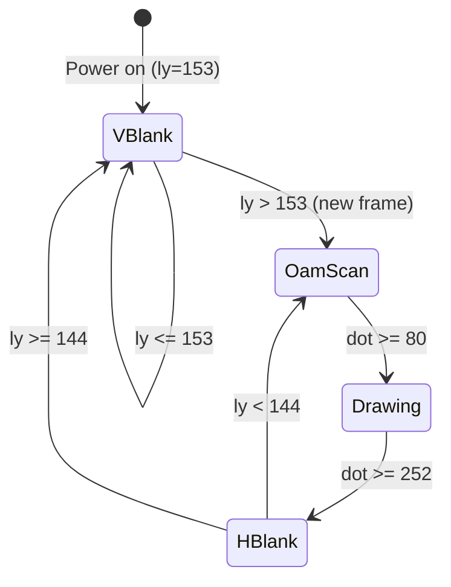

# Service Operations Catalog

Operational semantics of the GB emulator: state machines, data transformations, guards, and temporal rules.

## State Machines

### PPU Mode Machine

The PPU cycles through four modes per scanline, governing memory access and rendering.

| State | Mode ID | Duration | Memory Locks | Entry Action |
| --- | --- | --- | --- | --- |
| OamScan | 2 | 80 dots | OAM locked | STAT interrupt (if enabled) |
| Drawing | 3 | 172 dots | OAM + VRAM locked | Render scanline at exit |
| HBlank | 0 | 204 dots | None | STAT interrupt (if enabled) |
| VBlank | 1 | 4560 dots (10 lines) | None | VBlank + STAT interrupts |

**Evidence**: `gb-core/src/ppu/mod.rs:15-24` (enum), `gb-core/src/ppu/mod.rs:177-227` (transitions)

**Timing**: 456 dots/scanline x 154 scanlines = 70,224 T-cycles/frame

**Diagram**: [diagrams/flow/ppu-lifecycle.mmd](diagrams/flow/ppu-lifecycle.mmd)

### CPU Execution State

| State | Behavior | Exit Condition |
| --- | --- | --- |
| Running | Fetch-decode-execute cycle | HALT instruction |
| Halted | Consume 4 T-cycles (idle) | Any pending interrupt (IE & IF != 0) |

**HALT Bug**: When HALT executed with IME=0 and (IE & IF) != 0, the CPU resumes but the next opcode byte is read twice (PC fails to increment).

**Evidence**: `gb-core/src/cpu/mod.rs:9-13` (enum), `gb-core/src/cpu/mod.rs:57-60` (halt logic), `gb-core/src/cpu/mod.rs:67-70` (halt bug)

### DMA Transfer State

| State | Behavior | Duration |
| --- | --- | --- |
| Idle | No transfer | - |
| Active | Copy 160 bytes to OAM, 1 byte/4 T-cycles | 640 T-cycles |

**Trigger**: Write to 0xFF46 sets source high byte, begins transfer.

**Evidence**: `gb-core/src/dma.rs:29-35` (write trigger), `gb-core/src/dma.rs:47-76` (tick)

### APU Power State

| State | Behavior | Transition |
| --- | --- | --- |
| On (NR52 bit 7 = 1) | All channels active, registers writable | Write 0 to NR52 bit 7 |
| Off (NR52 bit 7 = 0) | All channels reset, registers read 0xFF | Write 1 to NR52 bit 7 |

**Exception**: Length counters (NRx1) writable when powered off on DMG. Wave RAM always accessible.

**Evidence**: `gb-core/src/apu/mod.rs:372-389` (write_nr52), `gb-core/src/apu/mod.rs:312-322` (power-off write guard)

## Data Transformations

### Tile Pixel Decode

**Operation**: Extract 2-bit color ID from two tile data bytes.

**Formula**: `color_id = (hi >> (7 - pixel_x)) & 1) << 1 | ((lo >> (7 - pixel_x)) & 1)`

**Input**: 2 bytes (lo, hi) from VRAM tile data + pixel_x (0-7)

**Output**: 2-bit color ID (0-3)

**Evidence**: `gb-core/src/ppu/mod.rs:683-688` (pixel_colour_id)

### Palette Mapping

**Operation**: Map 2-bit color ID through palette register to shade.

**Formula**: `shade = (palette >> (color_id * 2)) & 0x03`

**Input**: Palette register (BGP/OBP0/OBP1) + color ID (0-3)

**Output**: 2-bit shade (0-3, where 0=lightest, 3=darkest)

**Evidence**: `gb-core/src/ppu/mod.rs:694-696` (apply_palette)

### Tile Data Address Calculation

**Operation**: Compute VRAM address for a tile row.

| LCDC Bit 4 | Base Address | Index Type | Formula |
| --- | --- | --- | --- |
| 1 | 0x8000 | Unsigned | `0x8000 + index * 16 + row * 2` |
| 0 | 0x9000 | Signed (i8) | `0x9000 + (index as i8) * 16 + row * 2` |

**Evidence**: `gb-core/src/ppu/mod.rs:666-675` (tile_data_address)

### DMG Color Rendering

**Operation**: Map 2-bit shade to RGBA pixel for display.

| Shade | RGB (Hex) | Description |
| --- | --- | --- |
| 0 | `#9BBC0F` | Lightest green |
| 1 | `#8BAC0F` | Light green |
| 2 | `#306230` | Dark green |
| 3 | `#0F380F` | Darkest green |

**Evidence**: `gb-frontend/src/renderer.rs:4-9` (PALETTE constant)

**Diagram**: [diagrams/flow/scanline-rendering-transformations.mmd](diagrams/flow/scanline-rendering-transformations.mmd)

### APU DAC Conversion

**Operation**: Convert channel digital output to centered analog float.

**Formula**: `output = sample / 7.5 - 1.0` (when DAC enabled; 0.0 when disabled)

**Input**: Channel sample (0-15)

**Output**: Centered float (-1.0 to +1.0)

**Evidence**: `gb-core/src/apu/mod.rs:186-191` (dac_output)

### APU Stereo Mixer

**Operation**: Mix 4 channel DAC outputs into stereo via panning, volume, normalization, and high-pass filter.

**Pipeline**:

1. **NR51 Panning**: Each channel routed to left/right by individual bits
2. **NR50 Volume**: `channel_sum * (volume_bits + 1)`, volume range 1-8
3. **Normalize**: Divide by 32 (max = 1.0 DAC x 4 channels x 8 volume)
4. **High-Pass Filter**: First-order IIR, cutoff ~20 Hz, factor = `1 - 2*pi*20/sample_rate`
5. **Clamp**: Output clamped to [-1.0, +1.0]

**Evidence**: `gb-core/src/apu/mod.rs:177-228` (mix function)

**Diagram**: [diagrams/flow/audio-pipeline-transformations.mmd](diagrams/flow/audio-pipeline-transformations.mmd)

### Audio Sample Format Conversion

**Operation**: Convert f32 stereo to device-native format.

| Format | Formula | Evidence |
| --- | --- | --- |
| f32 | passthrough | `gb-frontend/src/audio.rs:69-75` |
| i16 | `sample * 32767` | `gb-frontend/src/audio.rs:83-88` |
| u16 | `(sample + 1.0) * 0.5 * 65535` | `gb-frontend/src/audio.rs:98-100` |

## Guards and Access Controls

### VRAM Access Lock (Mode 3)

| Condition | Read Result | Write Effect |
| --- | --- | --- |
| LCD on AND mode = Drawing | `0xFF` | Ignored |
| Otherwise | Actual VRAM data | Written |

**Exception**: PPU's own `vram_read_internal()` bypasses the lock.

**Evidence**: `gb-core/src/ppu/mod.rs:530-534` (read_vram), `gb-core/src/ppu/mod.rs:539-544` (write_vram)

### OAM Access Lock (Mode 2/3)

| Condition | Read Result | Write Effect |
| --- | --- | --- |
| LCD on AND mode = OamScan or Drawing | `0xFF` | Ignored |
| Otherwise | Actual OAM data | Written |

**Exception**: DMA transfers use `dma_write_oam()` which bypasses mode locks.

**Evidence**: `gb-core/src/ppu/mod.rs:548-566` (read/write_oam), `gb-core/src/ppu/mod.rs:569-571` (dma_write_oam)

### Sprite BG-over-OBJ Priority

| OAM Priority Bit | BG Color ID | Result |
| --- | --- | --- |
| 0 (sprite above) | Any | Sprite pixel shown |
| 1 (BG priority) | 0 (transparent) | Sprite pixel shown |
| 1 (BG priority) | 1-3 | BG pixel wins |

**Critical**: Uses raw color IDs (pre-palette), not palette-mapped shades.

**Evidence**: `gb-core/src/ppu/mod.rs:505-511` (priority check using `bg_color_ids`)

### Interrupt Dispatch Guard

| Condition | Result |
| --- | --- |
| IME = true AND (IE & IF & 0x1F) != 0 | Dispatch highest-priority interrupt |
| IME = false AND pending != 0 | Wake from HALT only (no dispatch) |
| IME = false AND pending = 0 | No action |

**Priority order**: VBlank (bit 0) > LCD STAT (1) > Timer (2) > Serial (3) > Joypad (4)

**Evidence**: `gb-core/src/interrupts.rs:57-82` (acknowledge), `gb-core/src/cpu/mod.rs:100-129` (handle_interrupts)

## Temporal Rules

| Rule | Trigger | Duration | Action | Evidence |
| --- | --- | --- | --- | --- |
| Frame period | Continuous | 70,224 T-cycles (16.74 ms) | PPU completes frame | `gb-core/src/lib.rs:21` |
| Frame pacing | about_to_wait | 16,742,706 ns | Sleep to maintain 59.73 Hz | `gb-frontend/src/main.rs` |
| DMA transfer | Write 0xFF46 | 640 T-cycles | Copy 160 bytes to OAM | `gb-core/src/dma.rs:33-34` |
| TIMA overflow delay | TIMA overflows | 4 T-cycles | Reload TMA, fire Timer IRQ | `gb-core/src/timer.rs:75-77` |
| EI delay | EI instruction | 1 instruction | IME enabled after next opcode | `gb-core/src/cpu/mod.rs:87-95` |
| Frame sequencer | Continuous | 8192 T-cycles (512 Hz) | Clock length/envelope/sweep | `gb-core/src/apu/frame_seq.rs` |
| Audio downsample | Continuous | CPU_CLOCK / sample_rate T-cycles | Emit one stereo sample | `gb-core/src/apu/mod.rs:167-171` |

### Timer Falling Edge Detection

The timer uses a falling-edge detector on `(selected_div_bit AND timer_enable)`:

| TAC Bits 1-0 | DIV Bit Monitored | TIMA Frequency |
| --- | --- | --- |
| 00 | Bit 9 | 4,096 Hz |
| 01 | Bit 3 | 262,144 Hz |
| 10 | Bit 5 | 65,536 Hz |
| 11 | Bit 7 | 16,384 Hz |

**Quirk**: Writing ANY value to DIV (0xFF04) resets the 16-bit counter to 0, which can trigger a falling edge and increment TIMA.

**Evidence**: `gb-core/src/timer.rs:58-82` (update_falling_edge), `gb-core/src/timer.rs:96-101` (DIV write)

## Configuration Semantics

| Register | Address | Type | Business Meaning | Used By |
| --- | --- | --- | --- | --- |
| LCDC | 0xFF40 | u8 bitmask | LCD master control: enables BG, sprites, window, tile addressing mode | PPU |
| STAT | 0xFF41 | u8 bitmask | LCD status interrupt sources: LYC match, mode 0/1/2 triggers | PPU |
| TAC | 0xFF07 | u8 | Timer control: enable + frequency select (4 rates) | Timer |
| NR50 | 0xFF24 | u8 | Master volume: left (bits 6-4) and right (bits 2-0), range 0-7 | APU |
| NR51 | 0xFF25 | u8 bitmask | Channel panning: 8 bits route CH1-4 to left/right | APU |
| NR52 | 0xFF26 | u8 | APU master enable (bit 7), channel status (bits 0-3 read-only) | APU |
| BGP | 0xFF47 | u8 | Background palette: maps color IDs 0-3 to shades 0-3 | PPU |
| OBP0/1 | 0xFF48-49 | u8 | Sprite palettes: maps color IDs 1-3 to shades (ID 0 = transparent) | PPU |

## Service Responsibility Boundaries

| Component | Responsible For | NOT Responsible For |
| --- | --- | --- |
| GameBoy | Frame loop orchestration, public API | Individual subsystem logic |
| Cpu | Instruction fetch/decode/execute, interrupt dispatch | Memory routing, timing of subsystems |
| Bus | Address decoding, subsystem tick orchestration, interrupt collection | Instruction execution, rendering |
| Ppu | Scanline rendering, mode state machine, VRAM/OAM access control | Color palette to RGBA (frontend), audio |
| Apu | Channel synthesis, mixing, downsampling | Audio device output (frontend) |
| Timer | DIV/TIMA counting, falling-edge detection, overflow handling | Interrupt dispatch (delegates to InterruptController) |
| InterruptController | IE/IF management, priority arbitration, acknowledge | Interrupt source detection (delegated from subsystems) |
| Cartridge | ROM/RAM banking, MBC register decode | Bus routing, address range decisions |
| Dma | OAM transfer sequencing, byte-by-byte scheduling | Memory reads (delegates to Bus), OAM writes (delegates to PPU) |
| renderer.rs | 2-bit shade to RGBA conversion | Frame buffer generation (gb-core) |
| audio.rs | Ring buffer, cpal stream, sample format conversion | Audio synthesis (gb-core APU) |
